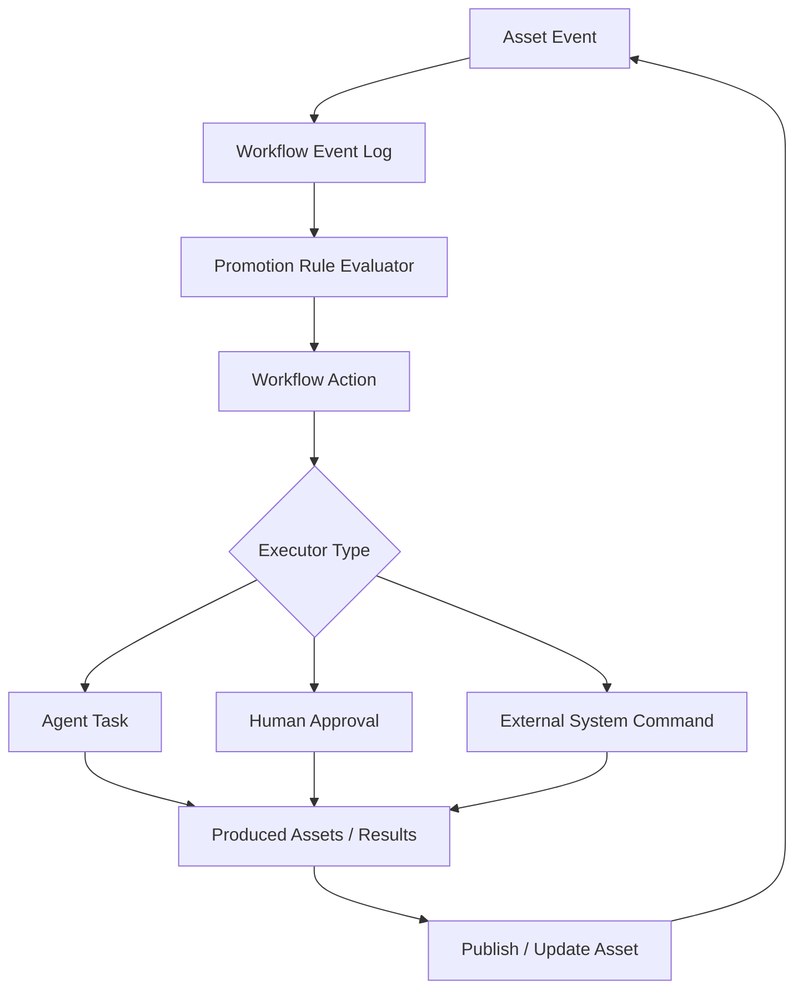

# Asset-Driven Workflow Automation Design

**Goal:** Extend ADAM from an asset dependency and state-tracking platform into a workflow driver that can move R&D work forward through events, rules, actions, agent tasks, and human approval gates.

**Status:** Design proposal.

**Related Design:** `docs/plans/2026-06-15-work-item-kind-dependency-model.md`

---

## 1. Problem Statement

The current ADAM model can answer:

- which assets depend on which upstream assets
- which upstream publish events make downstream assets Dirty
- what context an AI Agent should read before working
- what version baseline was declared or manually cleaned

This is necessary but not sufficient for driving an R&D process forward.

To automate a workflow, the system must also answer:

- what should happen next
- whether the next step is allowed
- who or what should execute the next step
- what output assets are expected
- how success, failure, retry, blocking, and approval are handled
- when a work item or workflow instance is complete

Dirty state is a signal that review may be needed. It is not a workflow engine.

## 2. Design Principle

Keep three concerns separate:

```text
Asset graph:
  What exists, what version it is, and what it depends on.

Propagation rules:
  Which asset changes affect which downstream assets.

Workflow automation:
  Which events should create actions, tasks, approvals, or follow-up work.
```

Do not overload `DependencyRule` to mean next workflow step.

The `EventOnly` propagation behavior deferred in the companion design is realized here through the `PromotionRule` -> `WorkflowAction` path. A matching asset event can create workflow work without marking the downstream asset Dirty.

## 3. Proposed Architecture



The loop is intentional. Asset changes create workflow events; workflow events create actions; actions produce or update assets; asset updates create new events. Cascade depth limits prevent the loop from running indefinitely.

## 4. New Domain Concepts

### WorkflowEvent

Immutable fact emitted by ADAM or an integrated system.

Examples:

```text
AssetPublished
AssetMarkedDirty
DirtyResolved
WorkItemCreated
WorkItemCompleted
PipelineRunCompleted
PipelineRunFailed
AgentTaskSucceeded
AgentTaskFailed
HumanApprovalGranted
HumanApprovalRejected
```

Core fields:

```text
id
organization_id
project_id
event_type
subject_asset_id
related_asset_ids
payload
source
occurred_at
correlation_id
causation_id
```

`source` uses a controlled vocabulary:

```text
adam
git_hook
mcp_agent
ci_system
external_api
```

`causation_id` is the ID of the workflow event that directly caused this event. `correlation_id` is stable across the whole workflow chain.

Workflow events are an append-only audit log, not the source of truth for current state. Current state lives in `WorkflowAction`, `WorkflowInstance`, `AgentTask`, and `ApprovalGate` tables. Events are used for traceability, debugging, and idempotent event-to-action processing; full event-sourced reconstruction is out of scope for the first implementation.

### PromotionRule

Rule that decides whether an event should create one or more workflow actions.

Examples:

```text
AssetPublished(requirement) -> create work_item(kind=feature)
AssetMarkedDirty(asset) -> create review_dirty_asset action
PipelineRunFailed -> request triage or create bugfix work item
DirtyResolved -> re-evaluate blocked actions
```

Core fields:

```text
id
name
enabled
event_type
asset_type_filter
metadata_filter
preconditions
action_template
automation_level
priority
scope
mutex_group
rule_version
effective_from
effective_until
mode
rollout_strategy
rollout_percentage
max_cascade_depth
```

`max_cascade_depth` defaults to `3` and can be lowered for high-risk rules.

`scope` is one of `Organization`, `Project`, or `AssetType`. `mode` is one of `Active`, `DryRun`, or `AuditOnly`. Dry-run rules evaluate and log the action they would create but do not mutate workflow state.

`rollout_strategy` is one of `All`, `ProjectAllowList`, `AssetTypeAllowList`, or `Percentage`. Percentage rollout must use a stable hash of `project_id + subject_asset_id + rule_id` so the same asset consistently sees the same rule version during rollout.

### WorkflowAction

Planned unit of process movement.

Action types for the first slice:

```text
create_work_item
create_virtual_asset_context
generate_code_change
run_pipeline
review_dirty_asset
manual_clean
publish_asset
request_human_approval
mark_work_item_completed
```

Statuses:

```text
Pending
Ready
InProgress
WaitingApproval
Blocked
Succeeded
Failed
Cancelled
Skipped
```

Core fields:

```text
id
workflow_instance_id
action_type
status
automation_level
target_asset_id
payload
is_required
cascade_depth
idempotency_key
max_retries
retry_count
timeout_seconds
next_retry_at
expires_at
created_by_event_id
```

`is_required` defaults to `true`. Optional actions can be skipped without failing the workflow instance.

### WorkflowInstance

Process container for a work item or another anchor asset.

Workflow states:

```text
Pending
Ready
InProgress
Blocked
WaitingReview
WaitingValidation
Completed
Failed
Cancelled
```

This state is separate from `AssetState`.

A `WorkflowInstance` owns one or more `WorkflowAction` records. An instance becomes `Completed` when all required actions are in a terminal state and at least one required action has `Succeeded`. It becomes `Failed` when a required action reaches `Failed` with no retry remaining. Optional actions can be `Skipped`, `Cancelled`, or `Failed` without failing the instance unless a rule explicitly marks them required.

### AgentTask

Executable task assigned to an AI Agent.

Task statuses:

```text
Queued
Claimed
Running
Succeeded
Failed
Cancelled
Expired
```

Agent tasks must be idempotent. Replaying the same event must not create duplicate active tasks.

Core operational fields:

```text
workflow_action_id
agent_id
capability_filter
claimed_at
timeout_seconds
expires_at
result_payload
produced_asset_ids
```

### ApprovalGate

Human decision point for risky or policy-sensitive actions.

Statuses:

```text
Pending
Approved
Rejected
Expired
Cancelled
```

Core decision fields:

```text
workflow_action_id
approver_type
approver_id
deadline
escalation_rule_id
decision_payload
decided_at
```

`approver_type` is one of `Role`, `User`, or `Group`.

## 5. State Machines

State transitions must be explicit at the service layer. Illegal transitions return a domain error and do not emit workflow events.

`WaitingReview` means the instance is waiting for a human decision, such as approval, manual Dirty review, or manual triage. `WaitingValidation` means the instance is waiting for automated or policy validation, such as a pipeline result, rule re-check, or generated artifact verification.

### WorkflowInstance

| From | Allowed To | Notes |
| --- | --- | --- |
| `Pending` | `Ready`, `Cancelled` | Instance has been created but no action is ready. |
| `Ready` | `InProgress`, `Blocked`, `Cancelled` | At least one required action can run. |
| `InProgress` | `Blocked`, `WaitingReview`, `WaitingValidation`, `Completed`, `Failed`, `Cancelled` | Driven by required action outcomes. |
| `Blocked` | `Ready`, `Failed`, `Cancelled` | Unblocked by dependency resolution, approval, or policy change. |
| `WaitingReview` | `Ready`, `Completed`, `Failed`, `Cancelled` | Human review can resume, complete, or fail the instance. |
| `WaitingValidation` | `Ready`, `Completed`, `Failed`, `Cancelled` | Validation result decides the next state. |
| `Completed` | none | Terminal. |
| `Failed` | none | Terminal. Create a new workflow instance for rework. |
| `Cancelled` | none | Terminal. |

### WorkflowAction

| From | Allowed To | Notes |
| --- | --- | --- |
| `Pending` | `Ready`, `Blocked`, `Cancelled`, `Skipped` | Preconditions decide readiness. |
| `Ready` | `InProgress`, `WaitingApproval`, `Blocked`, `Cancelled`, `Skipped` | Executor selection happens here. |
| `InProgress` | `Succeeded`, `Failed`, `Blocked`, `WaitingApproval`, `Cancelled` | Partial external effects are handled by compensation policy. |
| `WaitingApproval` | `Ready`, `Blocked`, `Failed`, `Cancelled` | Approval granted, rejected, expired, or cancelled. |
| `Blocked` | `Ready`, `Failed`, `Cancelled`, `Skipped` | Optional blocked actions may be skipped. |
| `Succeeded` | none | Terminal. |
| `Failed` | `Pending` only when retry budget remains | Otherwise terminal for the current action. |
| `Cancelled` | none | Terminal. |
| `Skipped` | none | Terminal. |

### AgentTask

| From | Allowed To | Notes |
| --- | --- | --- |
| `Queued` | `Claimed`, `Cancelled`, `Expired` | Claim must be atomic. |
| `Claimed` | `Running`, `Succeeded`, `Failed`, `Cancelled`, `Expired` | Short tasks may skip `Running`. |
| `Running` | `Succeeded`, `Failed`, `Cancelled`, `Expired` | Expiration releases or fails the parent action by retry policy. |
| `Succeeded` | none | Terminal. |
| `Failed` | none | Terminal. Parent action decides retry. |
| `Cancelled` | none | Terminal. |
| `Expired` | none | Terminal. Parent action decides retry. |

### ApprovalGate

| From | Allowed To | Notes |
| --- | --- | --- |
| `Pending` | `Approved`, `Rejected`, `Expired`, `Cancelled` | Only authorized approvers can decide. |
| `Approved` | none | Terminal. |
| `Rejected` | none | Terminal. |
| `Expired` | none | Terminal. |
| `Cancelled` | none | Terminal. |

## 6. Automation Levels

```text
Automatic
AgentSuggested
HumanApprovalRequired
HumanOnly
```

Examples:

| Action | Automation Level |
| --- | --- |
| create virtual context | `Automatic` |
| run pipeline | `Automatic` |
| generate code change | `AgentSuggested` |
| publish requirement major change | `HumanApprovalRequired` |
| manual clean Dirty design doc | `HumanApprovalRequired` |
| approve release | `HumanOnly` |

## 7. Workflow Templates

Workflow templates are named sets of `PromotionRule` records plus default action ordering. Start with organization-level templates that projects can override by disabling or replacing individual rules.

### Feature Workflow

```text
requirement published
  -> create or update work_item(kind=feature)
  -> create virtual context
  -> generate code change
  -> publish code_commit
  -> run pipeline
  -> mark ready for validation
  -> mark completed
```

### Bugfix Workflow

```text
bugfix work item created
  -> create virtual context from requirement/test_case/code context
  -> generate code change
  -> publish code_commit
  -> run regression tests
  -> if tests pass, mark completed
  -> if tests fail, block and request triage
```

### Test Execution Workflow

```text
test_execution work item created
  -> create virtual context from test_case and target assets
  -> run tests or create external test command
  -> capture PipelineRun summary
  -> if failed, create triage action
  -> if passed, mark completed
```

## 8. Event-To-Action Flows

### Requirement Publish To Feature Work

```text
Event: AssetPublished(requirement)
Rule: no active work_item(kind=feature) already implements this requirement
Action: create_work_item(kind=feature)
Postcondition: work_item exists and Implements -> requirement
```

### Dirty Asset To Review Work

```text
Event: AssetMarkedDirty(asset)
Rule: no active review_dirty_asset action exists for same asset/upstream version
Action: review_dirty_asset
Executor: HumanApprovalRequired by default
Postcondition: manual_clean or republish resolves dirty queue entry
```

### Pipeline Failure To Bugfix Work

No new `test_report` asset type is needed in the first slice.

```text
Event: PipelineRunFailed
Action: request_human_approval to create work_item(kind=bugfix)
Postcondition: approved action creates bugfix work item with references to pipeline run summary and related assets
```

## 9. Preconditions, Postconditions, And Failure Handling

Preconditions start as a small typed enum, not arbitrary JSON expressions:

```text
AssetExists
AssetNotArchived
AllDependenciesClean
NoUnresolvedCriticalDirty
RequiredApprovalExists
PipelineSucceeded
NoActiveDuplicateAction
```

JSON expression preconditions can be added later if product requirements need them, but the first implementation should keep validation explicit and testable.

Postconditions:

```text
asset version was published
expected dependency relationship exists
dirty queue entry was resolved
agent task produced result payload
pipeline run completed successfully
approval was granted
```

If preconditions are not met, the action becomes `Blocked`, not `Failed`.

Blocked reasons:

```text
MissingDependency
DirtyDependency
WaitingApproval
PipelineFailed
PolicyDenied
ExecutorUnavailable
ExternalSystemUnavailable
WaitingManualIntervention
```

Failure handling policy:

- Actions never roll back already-published asset versions. Cross-asset partial success is represented by workflow events and follow-up actions.
- A failed action with retry budget moves back to `Pending` after `next_retry_at`.
- A failed action with external side effects must either run a configured compensation action or move to `Blocked` with `WaitingManualIntervention`.
- A non-compensatable failure is recorded and escalated through an approval or manual triage action.
- Exhausted retries move the action to `Failed`; required action failure fails the workflow instance.
- Events or actions that cannot be processed after retry exhaustion are written to `workflow_dead_letters` for operator review.

Saga policy:

- `WorkflowInstance` is the Saga coordinator for multi-action workflows.
- Each side-effecting `WorkflowAction` declares `compensation_action_type`, `compensation_payload`, and `compensation_policy`.
- Compensation policy is one of `None`, `BestEffort`, `RequiredBeforeFail`, or `ManualOnly`.
- Required actions are ordered by dependency, not by table creation time.
- If a required action fails after one or more prior side-effecting actions succeeded, the instance enters `Blocked` with `WaitingManualIntervention` while compensation actions are scheduled.
- Published assets are not deleted or rewritten as compensation. Compensation creates new corrective assets, state transitions, or follow-up workflow actions.
- Saga recovery is resumable: after process restart, the coordinator reloads non-terminal instances and continues from persisted action states.

Promotion rules and actions need idempotency keys:

```text
rule_id + event_id + target_asset_id
workflow_instance_id + action_type + target_asset_id
```

Conflict resolution for overlapping rules:

1. Rule scope is evaluated from most specific to least specific: `AssetType`, `Project`, `Organization`.
2. Only rules inside their effective time window and rollout segment are eligible.
3. Rules in the same `mutex_group` are mutually exclusive for the same event and target.
4. For the same `mutex_group`, higher `rule_version` wins, then higher priority wins.
5. Same priority and target: safer automation level wins in this order: `HumanOnly`, `HumanApprovalRequired`, `AgentSuggested`, `Automatic`.
6. Same scope, version, priority, and automation level: first-created rule wins by rule ID.
7. Dry-run and audit-only rules never suppress active rules, but all evaluated rules are logged.

Cascade guard:

```text
triggering_action.cascade_depth < promotion_rule.max_cascade_depth
```

If the limit is exceeded, the evaluator records `CascadeDepthExceeded` and skips action creation.

Timeouts and retries:

- expired `AgentTask` records return their action to `Pending` or `Failed` depending on retry budget
- expired `ApprovalGate` records move the action to `Blocked` or `Failed` according to policy
- failed retryable actions set `next_retry_at` using the rule's backoff policy

## 10. Transactions, Concurrency, And Idempotency

Workflow writes must be safe under duplicate events, concurrent workers, and repeated agent submissions.

Isolation level:

- default to PostgreSQL `READ COMMITTED`
- use row-level locks for rows that are about to transition
- use unique constraints and conditional updates as the final correctness guard
- use `SERIALIZABLE` only for rule administration operations that must atomically replace active rule sets

Transaction boundaries:

- appending a `WorkflowEvent` and creating actions from it happens in one database transaction per event
- action state transitions are single-row conditional updates from the expected current state
- claiming an `AgentTask` is an atomic compare-and-set from `Queued` to `Claimed`
- approval decisions are atomic compare-and-set updates from `Pending` to a terminal decision
- publishing assets remains owned by the asset/version services; workflow records the outcome instead of wrapping the whole asset publish flow in one workflow transaction

Unique keys:

```text
workflow_events(id)
workflow_events(source, source_event_id)
workflow_actions(idempotency_key)
agent_tasks(workflow_action_id, task_kind) where status in active statuses
approval_gates(workflow_action_id, gate_kind) where status = Pending
promotion_rules(scope, event_type, mutex_group, rule_version)
workflow_dead_letters(source_kind, source_id, failure_fingerprint)
```

Locking and conflict handling:

- `WorkflowInstance` transitions lock the instance row and update `lock_version`
- `WorkflowAction` transitions use optimistic locking with `lock_version`; executor claim/start paths may additionally use `SELECT ... FOR UPDATE SKIP LOCKED`
- `AgentTask` claim uses `SELECT ... FOR UPDATE SKIP LOCKED` or an equivalent conditional update from `Queued` to `Claimed`
- `ApprovalGate` decisions use optimistic locking from `Pending` to a terminal state
- asset publish continues to use the asset/version service's own transaction and locking rules; workflow does not hold asset locks across agent or external-system execution
- use unique-key violation as the final idempotency guard, then reload the existing row
- evaluate matching promotion rules from a consistent snapshot inside the event-processing transaction
- when multiple workflow instances target the same asset, each action still uses a target-scoped idempotency key to prevent duplicate active work for the same event and target

## 11. Data Model Additions

Proposed tables:

```text
workflow_events
promotion_rules
workflow_instances
workflow_actions
agent_tasks
approval_gates
workflow_dead_letters
```

Each table should include `organization_id`, timestamps, and enough correlation fields to reconstruct the workflow chain.

Concurrency fields:

```text
workflow_instances.lock_version
workflow_actions.lock_version
agent_tasks.lock_version
approval_gates.lock_version
```

Dead-letter fields:

```text
id
organization_id
project_id
source_kind
source_id
failure_fingerprint
failure_payload
retry_count
last_error
status
assigned_to
created_at
resolved_at
```

Dead-letter status values:

```text
Open
Assigned
Replayed
Resolved
Ignored
```

Use a new migration, for example:

```text
migrations/014_workflow_automation.sql
```

Do not modify previously executed migrations.

This design intentionally lists entities and critical constraints rather than full DDL. Complete columns, indexes, foreign keys, check constraints, and JSONB payload schemas belong in `migrations/014_workflow_automation.sql` and must be reviewed with the implementation.

## 12. Service Boundaries

### WorkflowEventService

- append workflow events
- enforce event idempotency
- query by correlation ID, asset, and workflow instance

### PromotionRuleEvaluator

- load enabled rules for an event
- check filters and preconditions
- resolve overlapping rules by scope, version, mutex group, priority, and automation level
- support dry-run, audit-only, and staged rollout rule evaluation
- enforce cascade depth limits
- create workflow actions idempotently

### WorkflowInstanceService

- coordinate multi-action Saga progress
- schedule compensation actions when required actions fail after side effects
- recover non-terminal workflow instances after process restart
- move unrecoverable instances to manual intervention or dead letter

### WorkflowActionService

- transition actions through states
- check preconditions and postconditions
- manage retry, timeout, blocking, dead-letter, and compensation policies
- emit action result events

### AgentTaskService

- create tasks for agent-executable actions
- claim tasks
- submit task results
- link produced assets back to actions

### ApprovalGateService

- request approvals
- record decisions
- unblock or fail waiting actions

### Observability

The first implementation should emit structured logs or counters for:

- promotion rules evaluated, fired, and skipped
- workflow actions created, blocked, retried, failed, and completed
- agent task claim latency and execution latency
- approval wait time and expiration count
- cascade depth limit hits
- Saga compensation attempts and failures
- dead-letter entries opened, replayed, resolved, and ignored

### Permissions And Visibility

Workflow APIs and MCP tools must enforce project membership, organization scope, and approver authorization. Human-only and approval-required actions must be visible in operator-facing queries even when no UI is implemented yet.

## 13. API Contract Draft

The first implementation should expose REST endpoints only when the corresponding slice is implemented. Until then, this section is the design contract; `docs/rest-api.md` and `docs/openapi.yaml` should be updated in the same PR that implements the endpoint. A slice is not complete until its REST documentation and OpenAPI paths are updated or the slice explicitly documents that no REST surface is exposed.

Slice 1 REST draft:

```text
GET /api/workflow/events?project_id=&correlation_id=&asset_id=
GET /api/workflow/instances/{workflow_instance_id}
GET /api/workflow/actions?project_id=&status=&target_asset_id=
POST /api/workflow/events
```

Slice 2 REST draft:

```text
GET /api/agent-tasks?project_id=&status=queued&capability=
POST /api/agent-tasks/{task_id}/claim
POST /api/agent-tasks/{task_id}/result
```

Slice 3 REST draft:

```text
GET /api/approval-gates?project_id=&status=pending
GET /api/approval-gates/{gate_id}
POST /api/approval-gates/{gate_id}/approve
POST /api/approval-gates/{gate_id}/reject
POST /api/workflow/actions/{action_id}/retry
POST /api/workflow/actions/{action_id}/cancel
GET /api/workflow/dead-letters?project_id=&status=open
POST /api/workflow/dead-letters/{dead_letter_id}/replay
POST /api/workflow/dead-letters/{dead_letter_id}/resolve
POST /api/workflow/dead-letters/{dead_letter_id}/ignore
```

API responses should use the same snake_case state, action, event, and automation-level strings as MCP. All mutating endpoints require idempotency keys.

## 14. MCP Tool Interface

First-slice MCP tools for agent integration:

```text
list_pending_agent_tasks(project_id, capability_filter)
claim_agent_task(task_id, agent_id)
submit_agent_task_result(task_id, result_payload, produced_asset_ids)
query_workflow_state(workflow_instance_id)
```

`claim_agent_task` claims the task idempotently and returns the context required for execution. `submit_agent_task_result` stores the result payload, links produced assets, and emits the appropriate workflow event.

The first product version supports pull-based agent tasks only. Push assignment to named agents is deferred until there is a concrete scheduling requirement.

## 15. Implementation Slices

### Slice 1: Event-To-Action Core

1. Add `WorkflowEvent`.
2. Add `PromotionRule`.
3. Add `WorkflowAction`.
4. Implement idempotent event-to-action creation.
5. Implement one rule: requirement publish creates or updates `work_item(kind=feature)`.
6. Emit and query workflow events by correlation ID.
7. Document and verify transaction isolation, lock strategy, and unique constraints.

### Slice 2: Agent Task Execution

1. Add `AgentTask`.
2. Implement task listing, claiming, timeout, and result submission.
3. Implement one agent path: ready feature work item creates `AgentTask(create_virtual_asset_context)`.
4. Link produced assets back to the originating workflow action.

### Slice 3: Blocking And Approval

1. Add `ApprovalGate`.
2. Implement one blocking path: Dirty dependency blocks `publish_asset` until resolved.
3. Re-evaluate blocked actions when `DirtyResolved` is emitted.
4. Support human approval for manual clean and bugfix creation from pipeline failure.
5. Add dead-letter review and replay operations.
6. Add Saga compensation scheduling for failed side-effecting workflows.

## 16. Acceptance Criteria

### Slice 1

1. Publishing a requirement emits `AssetPublished`.
2. A promotion rule creates exactly one feature work item action for that requirement.
3. Replaying the same event does not create a duplicate active action.
4. Completing the action creates or links a `work_item(kind=feature)`.
5. Overlapping rules resolve deterministically by scope, version, mutex group, priority, and automation level.
6. Cascade depth limits prevent repeated event-to-action loops.
7. Duplicate and concurrent event processing produces one active action per idempotency key.
8. Illegal state transitions are rejected without emitting workflow events.
9. Rule rollout and mutex behavior are deterministic for the same event and target.

### Slice 2

1. A ready feature work item can create an agent task with context asset IDs.
2. An agent task can be listed, claimed, completed, and linked to produced assets.
3. Expired agent tasks are retried or failed according to retry budget.
4. Concurrent task claims allow only one agent to own the task.

### Slice 3

1. If a required dependency is Dirty, the related workflow action becomes `Blocked`.
2. Resolving the Dirty dependency re-evaluates and unblocks the action.
3. Approval gates record approver identity, deadline, and decision payload.
4. Every automatic transition emits a workflow event.
5. A correlation ID reconstructs the workflow chain from requirement publish to agent task result.
6. Failed non-compensatable actions are blocked or dead-lettered with enough context for manual triage.
7. A workflow with prior side effects and a later required failure schedules configured compensation actions.
8. Dead-letter entries can be listed, replayed, resolved, or ignored by an operator.
9. REST documentation and OpenAPI are updated for every implemented REST endpoint in the slice.

## 17. Open Questions

1. Which actions require human approval by default in the first product release?
2. Should pipeline runs remain separate records only, or can selected pipeline results become asset instances later?
3. Which workflow metrics must be surfaced in product UI versus logs only?
4. What future requirements would justify push assignment to named agents?

## 18. Non-Goals

This design does not introduce:

- a full BPMN engine
- visual workflow editing
- cross-project workflow propagation
- automatic merge or deployment
- unrestricted Agent autonomy
- new `defect_report` or `test_report` asset types
