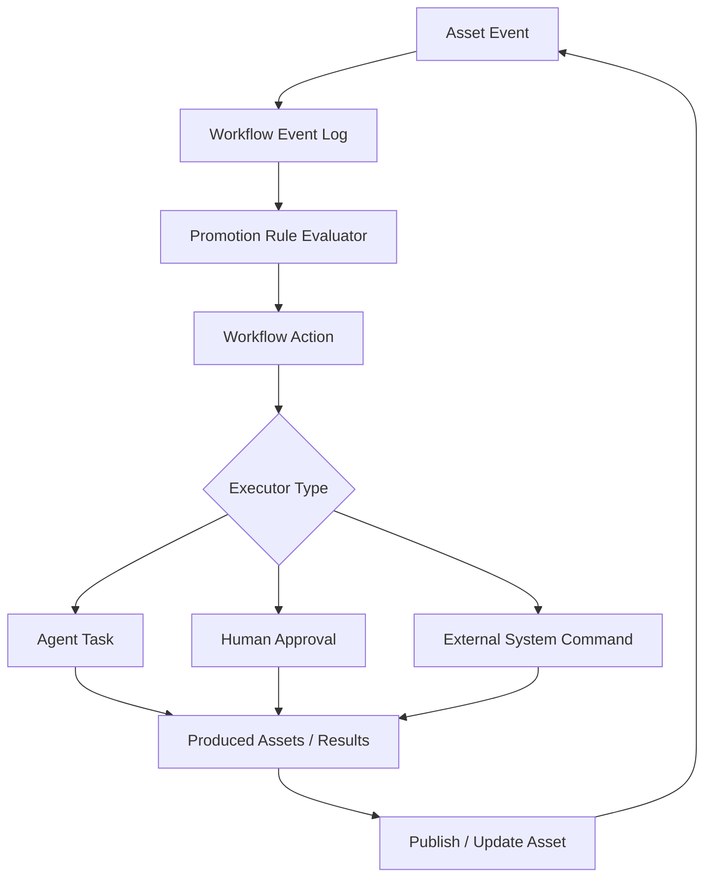

# Asset-Driven Workflow Automation Design

**Goal:** Extend ADAM from an asset dependency and state-tracking platform into a workflow driver that can move R&D work forward through events, rules, actions, agent tasks, and human approval gates.

**Status:** Design proposal.

**Related Design:** `docs/plans/2026-06-15-work-item-kind-dependency-model.md`

---

## 1. Problem Statement

The current ADAM model can answer:

- which assets depend on which upstream assets
- which upstream publish events make downstream assets Dirty
- what context an AI Agent should read before working
- what version baseline was declared or manually cleaned

This is necessary but not sufficient for driving an R&D process forward.

To automate a workflow, the system must also answer:

- what should happen next
- whether the next step is allowed
- who or what should execute the next step
- what output assets are expected
- how success, failure, retry, blocking, and approval are handled
- when a work item or workflow instance is complete

Dirty state is a signal that review may be needed. It is not a workflow engine.

## 2. Design Principle

Keep three concerns separate:

```text
Asset graph:
  What exists, what version it is, and what it depends on.

Propagation rules:
  Which asset changes affect which downstream assets.

Workflow automation:
  Which events should create actions, tasks, approvals, or follow-up work.
```

Do not overload `DependencyRule` to mean next workflow step.

## 3. Proposed Architecture



The loop is intentional. Asset changes create workflow events; workflow events create actions; actions produce or update assets; asset updates create new events.

## 4. New Domain Concepts

### WorkflowEvent

Immutable fact emitted by ADAM or an integrated system.

Examples:

```text
AssetPublished
AssetMarkedDirty
DirtyResolved
WorkItemCreated
WorkItemCompleted
PipelineRunCompleted
PipelineRunFailed
AgentTaskSucceeded
AgentTaskFailed
HumanApprovalGranted
HumanApprovalRejected
```

Core fields:

```text
id
organization_id
project_id
event_type
subject_asset_id
related_asset_ids
payload
source
occurred_at
correlation_id
causation_id
```

### PromotionRule

Rule that decides whether an event should create one or more workflow actions.

Examples:

```text
AssetPublished(requirement) -> create work_item(kind=feature)
AssetMarkedDirty(asset) -> create review_dirty_asset action
PipelineRunFailed -> request triage or create bugfix work item
DirtyResolved -> re-evaluate blocked actions
```

Core fields:

```text
id
name
enabled
event_type
asset_type_filter
metadata_filter
preconditions
action_template
automation_level
priority
```

### WorkflowAction

Planned unit of process movement.

Action types for the first slice:

```text
create_work_item
create_virtual_asset_context
generate_code_change
run_pipeline
review_dirty_asset
manual_clean
publish_asset
request_human_approval
mark_work_item_completed
```

Statuses:

```text
Pending
Ready
InProgress
WaitingApproval
Blocked
Succeeded
Failed
Cancelled
Skipped
```

### WorkflowInstance

Process container for a work item or another anchor asset.

Workflow states:

```text
Pending
Ready
InProgress
Blocked
WaitingReview
WaitingValidation
Completed
Failed
Cancelled
```

This state is separate from `AssetState`.

### AgentTask

Executable task assigned to an AI Agent.

Task statuses:

```text
Queued
Claimed
Running
Succeeded
Failed
Cancelled
Expired
```

Agent tasks must be idempotent. Replaying the same event must not create duplicate active tasks.

### ApprovalGate

Human decision point for risky or policy-sensitive actions.

Statuses:

```text
Pending
Approved
Rejected
Expired
Cancelled
```

## 5. Automation Levels

```text
Automatic
AgentSuggested
HumanApprovalRequired
HumanOnly
```

Examples:

| Action | Automation Level |
| --- | --- |
| create virtual context | `Automatic` |
| run pipeline | `Automatic` |
| generate code change | `AgentSuggested` |
| publish requirement major change | `HumanApprovalRequired` |
| manual clean Dirty design doc | `HumanApprovalRequired` |
| approve release | `HumanOnly` |

## 6. Workflow Templates

### Feature Workflow

```text
requirement published
  -> create or update work_item(kind=feature)
  -> create virtual context
  -> generate code change
  -> publish code_commit
  -> run pipeline
  -> mark ready for validation
  -> mark completed
```

### Bugfix Workflow

```text
bugfix work item created
  -> create virtual context from requirement/test_case/code context
  -> generate code change
  -> publish code_commit
  -> run regression tests
  -> if tests pass, mark completed
  -> if tests fail, block and request triage
```

### Test Execution Workflow

```text
test_execution work item created
  -> create virtual context from test_case and target assets
  -> run tests or create external test command
  -> capture PipelineRun summary
  -> if failed, create triage action
  -> if passed, mark completed
```

## 7. Event-To-Action Flows

### Requirement Publish To Feature Work

```text
Event: AssetPublished(requirement)
Rule: no active work_item(kind=feature) already implements this requirement
Action: create_work_item(kind=feature)
Postcondition: work_item exists and Implements -> requirement
```

### Dirty Asset To Review Work

```text
Event: AssetMarkedDirty(asset)
Rule: no active review_dirty_asset action exists for same asset/upstream version
Action: review_dirty_asset
Executor: HumanApprovalRequired by default
Postcondition: manual_clean or republish resolves dirty queue entry
```

### Pipeline Failure To Bugfix Work

No new `test_report` asset type is needed in the first slice.

```text
Event: PipelineRunFailed
Action: request_human_approval to create work_item(kind=bugfix)
Postcondition: approved action creates bugfix work item with references to pipeline run summary and related assets
```

## 8. Preconditions, Postconditions, And Failure Handling

Preconditions:

```text
asset exists
asset is not Archived
all required dependencies are Clean or Final
no unresolved critical Dirty entry
required approval exists
pipeline run status is success
no duplicate active action exists for same target
```

Postconditions:

```text
asset version was published
expected dependency relationship exists
dirty queue entry was resolved
agent task produced result payload
pipeline run completed successfully
approval was granted
```

If preconditions are not met, the action becomes `Blocked`, not `Failed`.

Blocked reasons:

```text
MissingDependency
DirtyDependency
WaitingApproval
PipelineFailed
PolicyDenied
ExecutorUnavailable
ExternalSystemUnavailable
```

Promotion rules and actions need idempotency keys:

```text
rule_id + event_id + target_asset_id
workflow_instance_id + action_type + target_asset_id
```

## 9. Data Model Additions

Proposed tables:

```text
workflow_events
promotion_rules
workflow_instances
workflow_actions
agent_tasks
approval_gates
```

Each table should include `organization_id`, timestamps, and enough correlation fields to reconstruct the workflow chain.

## 10. Service Boundaries

### WorkflowEventService

- append workflow events
- enforce event idempotency
- query by correlation ID, asset, and workflow instance

### PromotionRuleEvaluator

- load enabled rules for an event
- check filters and preconditions
- create workflow actions idempotently

### WorkflowActionService

- transition actions through states
- check preconditions and postconditions
- manage retry, timeout, and blocking
- emit action result events

### AgentTaskService

- create tasks for agent-executable actions
- claim tasks
- submit task results
- link produced assets back to actions

### ApprovalGateService

- request approvals
- record decisions
- unblock or fail waiting actions

## 11. First Implementation Slice

Recommended first slice:

1. Add `WorkflowEvent`.
2. Add `PromotionRule`.
3. Add `WorkflowAction`.
4. Add `AgentTask`.
5. Implement idempotent event-to-action creation.
6. Implement one workflow: requirement publish creates or updates `work_item(kind=feature)`.
7. Implement one agent path: ready feature work item creates `AgentTask(create_virtual_asset_context)`.
8. Implement one blocking path: Dirty dependency blocks `publish_asset` until resolved.

## 12. Acceptance Criteria

1. Publishing a requirement emits `AssetPublished`.
2. A promotion rule creates exactly one feature work item action for that requirement.
3. Replaying the same event does not create a duplicate active action.
4. Completing the action creates or links a `work_item(kind=feature)`.
5. A ready feature work item can create an agent task with context asset IDs.
6. An agent task can be claimed, completed, and linked to produced assets.
7. If a required dependency is Dirty, the related workflow action becomes `Blocked`.
8. Resolving the Dirty dependency re-evaluates and unblocks the action.
9. Every automatic transition emits a workflow event.
10. A correlation ID reconstructs the workflow chain from requirement publish to agent task result.

## 13. Open Questions

1. Should workflow templates be organization-level configuration, project-level configuration, or both?
2. Should `PromotionRule.preconditions` start as a small enum language instead of JSON expressions?
3. Should Agent tasks be pulled by agents, pushed to named agents, or both?
4. Which actions require human approval by default in the first product release?
5. Should pipeline runs remain separate records only, or can selected pipeline results become asset instances later?

## 14. Non-Goals

This design does not introduce:

- a full BPMN engine
- visual workflow editing
- cross-project workflow propagation
- automatic merge or deployment
- unrestricted Agent autonomy
- new `defect_report` or `test_report` asset types
