# ADAM 系统概要设计

**版本**: 0.1
**日期**: 2026-06-17
**状态**: 草案

---

## 1. 设计目标

ADAM（AI-Driven Asset Management）是一个面向 AI Agent 与研发团队的研发资产管理系统。随着 AI Agent 参与研发流程，DevOps 平台的使用者已从纯人工操作演进为人机协同模式。当前 DevOps 平台对 AI Agent 仍以各中心独立接口的形式暴露能力，Agent 虽可访问各中心内容，但缺乏统一的资产关系层来理解需求、工作项、设计、代码、测试与流水线之间的关联。Agent 执行研发任务时，需构造完整、准确且不过度冗余的上下文，而这些上下文通常来自多个 DevOps 模块之间的关联关系。

ADAM 的设计目标并非复制 Git、Wiki、Jira、CI/CD 等系统的内容与功能，而是在这些系统之上建立统一的研发资产索引与关系层。系统将需求、工作项、设计文档、代码提交、测试用例、流水线等研发产物统一抽象为资产，通过显式依赖关系、版本基线、状态传播与工作流事件，将原本分散在不同工具中的研发事实关联起来。AI Agent 可通过统一入口检索资产、理解资产间的影响关系、构造任务所需上下文并基于上下文推理与执行；研发人员亦可获得一致、可追溯、可审计的资产视图。

基于上述目标，ADAM 提供三项核心能力：

1. 管理当前存在的研发资产及其版本与状态。
2. 追踪资产上游依赖关系，分析上游变化对下游的影响。
3. 当资产变化、进入 Dirty、验证失败或需要审批时，触发相应的后续处理动作。

## 2. 设计原则

本节阐述系统设计的基本原则与权衡。设计原则不对应某一独立模块，而是约束后续所有模块的职责边界：资产图负责表达结构化事实，状态传播负责维护资产可信状态，工作流自动化负责驱动处理流程。此划分旨在避免系统早期将依赖规则、状态规则与流程规则混为一体，形成难以维护的通用规则引擎。

### 2.1 三类职责分离

ADAM 明确区分三类职责：

| 职责 | 关注点 | 典型问题 |
| --- | --- | --- |
| 资产图 | 资产定义、版本信息和上游依赖关系 | 代码提交实现了哪个工作项？测试用例验证哪个需求？ |
| 传播规则 | 上游发布后，下游是否 Dirty | 需求变更后，feature 工作项是否需要重新审查？ |
| 工作流自动化 | 事件发生后应创建的流程动作 | 需求发布后是否创建 feature 工作项？流水线失败后是否创建 bugfix？ |

依赖规则不承担流程引擎职责，Dirty 状态也不等同于工作流状态。Dirty 仅表示“需要审查或重新发布”的状态信号；工作流负责将该信号转化为动作、任务或审批。

### 2.2 外部内容、内部索引

ADAM 保存可索引、可追溯、可决策的数据：

- 资产类型和元数据 schema
- 资产实例及其当前版本
- 发布依赖快照和当前有效依赖基线
- Dirty 队列与手工 Clean 记录
- 工作流事件、动作、Agent 任务、审批和死信记录

实际内容仍在外部系统中：

- 代码在 Git 平台
- 文档在 Wiki 或文档系统
- 工作任务在项目管理系统
- 流水线日志在 CI/CD 系统

## 3. 核心概念

本节定义系统核心术语，为业务、架构、开发与 AI Agent 集成方建立一致的理解基础。后续章节将复用这些概念。关键设计决策为：ADAM 仅抽象研发资产与研发协作状态，不接管外部系统中的原始内容与完整过程状态。

### 3.1 资产类型

资产类型用于定义研发资产的分类、元数据结构及允许参与的依赖规则，是系统进行校验、查询、传播与自动化的基础分类。ADAM 采用少量稳定的资产类型覆盖主要研发产物，通过元数据表达更细粒度的业务差异；若每一种工作场景均创建独立资产类型（如 `bug`、`test_execution`、`release_task`），依赖规则与状态传播矩阵将迅速膨胀。系统内置首批资产类型：

| 资产类型 | 说明 |
| --- | --- |
| `requirement` | 需求或缺陷范围描述 |
| `work_item` | 研发工作容器，通过 `metadata.work_item_kind` 区分子类型 |
| `design_doc` | 概要设计、详细设计、技术方案等 |
| `code_commit` | 代码提交或代码变更引用 |
| `test_case` | 测试用例、验证场景 |
| `pipeline` | 流水线定义或可执行流水线资产 |

### 3.2 工作项子类型

工作项子类型用于将 `work_item` 从单一“需求拆解任务”扩展为通用工作容器。系统通过 `metadata.work_item_kind` 支持 feature、bugfix、test_execution 等不同工作语义，同时保持既有 `work_item` 类型和接口稳定。该设计基于工作项适合作为流程承载对象这一判断，使同一个资产类型能够服务多种工作流，而无需为每个工作流新增资产类型。

`work_item` 不拆成多个资产类型，而是在元数据中使用 `work_item_kind` 区分用途。首批子类型为：

| 子类型 | 说明 |
| --- | --- |
| `feature` | 实现需求的功能工作 |
| `bugfix` | 修复需求、缺陷范围或验证失败的问题 |
| `test_execution` | 执行测试用例或验证目标资产 |

这种设计保持资产类型数量稳定，同时允许依赖规则根据元数据推断更具体的关系语义和传播策略。

### 3.3 资产实例

资产实例是系统管理的最小业务对象，表示一个具体的需求、工作项、设计文档、代码提交、测试用例或流水线记录。由于系统不保存完整内容，仅保存可索引、可追溯、可判断影响的结构化数据，资产实例必须同时包含外部引用、版本、状态、元数据与依赖基线。资产实例包含：

- 资产类型
- 名称和外部引用
- 所属组织、项目、层级
- 当前版本
- 当前状态
- 元数据
- 责任人、发布人
- 当前有效依赖基线

资产分为两类层级：

| 层级 | 说明 |
| --- | --- |
| 项目级资产 | 属于特定项目，只能与同项目资产建立持久化依赖 |
| 组织级资产 | 跨项目共享，如编码规范，只能与同组织组织级资产建立持久化依赖 |

项目查询可以合并返回组织级资产作为上下文，但这种合并不形成持久化依赖边，也不参与 Dirty 传播。

### 3.4 版本与基线

版本与基线用于区分历史事实和当前判断依据：系统既要能够追溯某次发布时声明的依赖关系，也要能够判断当前资产是否落后于上游最新版本。发布快照不可变，适合审计；当前有效基线会随重新发布或手工 Clean 前进，适合上下文查询和 Dirty 判断。若将二者合并，会导致审计事实被“修正”，并使手工 Clean 难以准确表达。

ADAM 区分两个版本概念：

| 概念 | 说明 |
| --- | --- |
| 发布依赖快照 | 资产发布时声明的上游资产和版本，用于历史追溯，不可原地修改 |
| 当前有效依赖基线 | 当前用于上下文查询和 Dirty 判断的上游版本，可由重新发布或手工 Clean 更新 |

发布依赖快照记录发布时声明的上游依赖版本，当前有效依赖基线记录当前判断是否过期时采用的上游版本基准。

### 3.5 依赖关系类型

依赖关系类型表达两个资产之间的业务语义，而不仅表示“存在一条边”。同样是从 A 指向 B，`implements`、`references`、`executes` 对下游的影响完全不同；显式关系类型使系统能够根据关系语义决定是否传播 Dirty、是否作为上下文、是否仅用于审计，避免将所有依赖边都视为强依赖。

依赖关系表示一个下游资产与一个上游资产的语义关系。边方向固定为：

```text
下游资产 source -> 上游资产 target
```

关系类型包括：

| 关系 | 语义 | 默认传播策略 |
| --- | --- | --- |
| `depends_on` | 一般依赖 | Dirty |
| `implements` | 下游实现上游 | Dirty |
| `fixes` | 下游修复上游 | Dirty |
| `verifies` | 下游验证上游 | Dirty |
| `references` | 下游引用上游作为上下文 | ContextOnly |
| `executes` | 下游执行上游 | ContextOnly |
| `produces` | 下游产生上游或产物记录 | AuditOnly |
| `blocks` | 下游阻塞上游 | AuditOnly |
| `relates_to` | 通用关联 | AuditOnly |

### 3.6 传播策略

传播策略决定上游发布后，下游资产是否进入 Dirty。AI 上下文需要更多引用边，但 Dirty 传播必须克制；因此依赖图既要能服务状态传播，也要能服务上下文和审计。将关系类型和传播策略分离后，系统可以表达“引用它，但它变化不要求我更新”。

传播策略决定上游发布后是否影响下游状态：

| 策略 | 说明 |
| --- | --- |
| `Dirty` | 上游发布新版本时，下游进入 Dirty |
| `ContextOnly` | 仅用于上下文查询，不触发 Dirty |
| `AuditOnly` | 仅用于审计和追溯，不触发 Dirty |

策略解析顺序为：

```text
发布请求显式指定
  -> 最具体的元数据匹配规则
  -> 类型级依赖规则
  -> 关系类型默认策略
```

### 3.7 资产状态

资产状态描述资产当前是否可信、是否需要处理、是否仍可维护。系统使用少量状态支撑研发资产生命周期，同时将 Dirty 的来源、版本、优先级和处理历史放入 Dirty 队列，而不是嵌入状态枚举；这样可以保持状态模型简洁稳定，并使 Dirty 细节能够被单独建模和查询。

资产实例有三类可变状态和一类不可变状态：

| 状态 | 说明 |
| --- | --- |
| `Clean` | 当前资产可信，上游变化已同步或审查确认无影响 |
| `Dirty` | 至少一个上游资产发布了新版本，当前资产尚未处理 |
| `Archived` | 资产停止维护，不再发布，不接收 Dirty |
| `Final` | 不可变资产状态，如代码提交、流水线执行记录，创建后不变 |

只有发布新版本会触发下游 Dirty。手工 Clean、归档和状态刷新不会向下游继续传播。

### 3.8 工作流概念

工作流概念用于描述从“资产事件”到“后续处理动作”的自动化链路。ADAM 不仅需要识别资产是否 Dirty，还需要决定是否创建工作项、创建 Agent 任务、等待审批、阻塞发布或进入人工介入处理。Dirty 是状态信号，不是流程引擎；工作流单独建模后，任务领取、审批、补偿、重试和审计都可以在独立的流程模型中处理。

| 概念 | 说明 |
| --- | --- |
| WorkflowEvent | 资产或外部系统产生的不可变事件，用于审计和触发规则 |
| PromotionRule | 决定事件是否应生成工作流动作的规则 |
| WorkflowInstance | 一组相关动作的流程容器，也是 Saga 协调器 |
| WorkflowAction | 一个待执行、执行中或已完成的流程动作 |
| AgentTask | 分配给 AI Agent 的可领取任务 |
| ApprovalGate | 需要人工审批或人工判断的决策点 |
| WorkflowDeadLetter | 多次处理失败后进入人工处理队列的记录 |

## 4. 总体架构

本节从高层说明系统组织方式，将业务能力映射至系统边界与模块边界。ADAM 同时面对 REST、MCP、Git Hook、CI/CD 等多种入口；若各入口独立实现业务规则，规则将重复且难以保持一致。因此系统采用"接口适配、应用编排、领域规则、基础设施实现"的分层架构，使所有入口共享同一组应用服务与领域模型，核心业务规则不依赖于具体协议或外部平台。

### 4.1 系统上下文

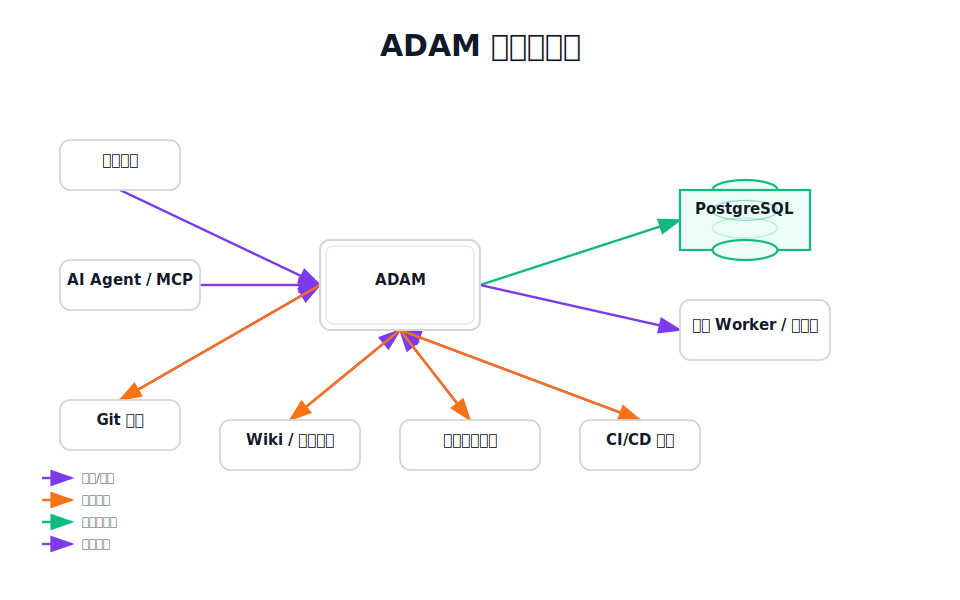

ADAM 对外提供 REST API、MCP 工具和自动化接入能力。外部系统可以通过发布接口、Hook、Webhook 或 CI/CD 集成向 ADAM 注册资产和事件。AI Agent 通过 MCP 查询上下文、领取任务、回写执行结果。

### 4.2 逻辑分层


接口层只负责协议和适配。应用层承载用例编排。领域层定义资产、依赖、版本、状态和工作流规则。基础设施层负责数据库、异步执行、外部系统连接。

### 4.3 模块关系

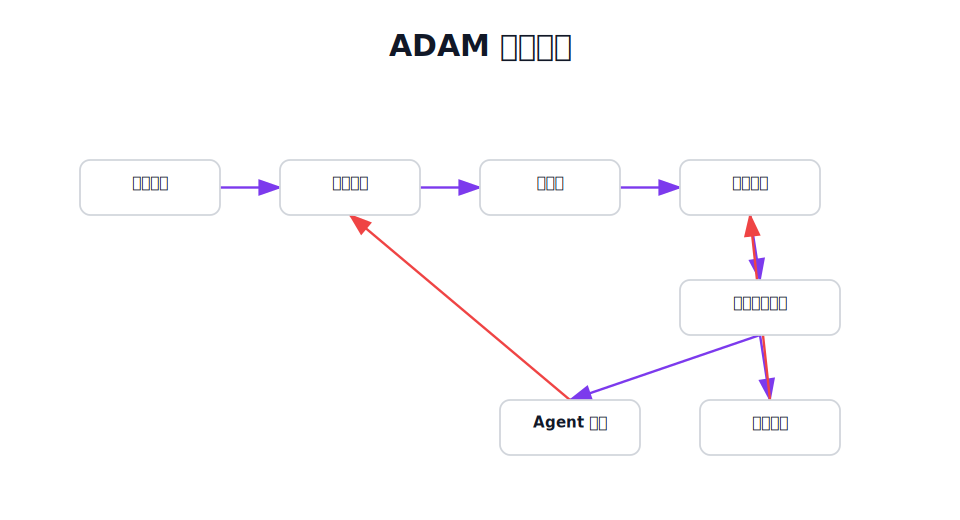

资产管理提供资产实例和类型基础。版本发布固化发布快照和当前基线。依赖图提供合法性校验、DAG 约束、上下游查询和影响分析。状态传播根据发布事件维护 Dirty。工作流自动化监听资产事件，将事件推进为工作项、任务、审批或人工处理。

### 4.4 运行时组件

本节说明系统部署后各类进程的职责分工。REST API 与 MCP Server 提供同步入口，负责鉴权、参数校验与用例编排；异步 Worker 负责事件分发、规则评估、Dirty 传播、工作流动作执行与失败重试；外部连接器负责接收或拉取 Git、Wiki、项目管理系统、CI/CD 系统中的事实。所有运行时组件共享同一数据库与领域规则，避免不同入口产生不一致的资产状态或工作流结果。


## 5. 资产与依赖设计

本节说明系统如何表达研发资产之间的影响关系，为上下文查询、影响分析、Dirty 传播与工作流触发提供统一的事实基础。依赖图是 ADAM 的核心数据结构，必须严格无环、语义明确、边界清晰，并能够通过元数据规则支持工作项子类型；若依赖图允许循环、跨项目混用或语义模糊，状态传播与自动化工作流将失去可解释性。

### 5.1 依赖图

实例依赖图是严格 DAG。系统禁止直接或间接循环依赖。

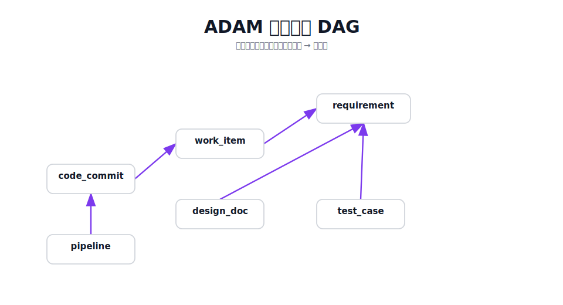

图中箭头方向表示“左侧依赖右侧”。例如 `code_commit -> work_item` 表示代码提交依赖工作项，工作项是代码提交的上游。

### 5.2 Work Item 依赖语义

`work_item` 是统一的工作容器，子类型通过元数据区分。依赖规则根据 `work_item_kind` 推断关系和传播策略。

| 下游资产 | 元数据条件 | 关系 | 上游资产 | 传播策略 | 说明 |
| --- | --- | --- | --- | --- | --- |
| `work_item` | `feature` | `implements` | `requirement` | Dirty | 功能工作实现需求 |
| `work_item` | `bugfix` | `fixes` | `requirement` | Dirty | 修复需求或缺陷范围 |
| `work_item` | `bugfix` | `references` | `test_case` | ContextOnly | 引用复现或验证场景 |
| `work_item` | `test_execution` | `executes` | `test_case` | ContextOnly | 执行测试用例 |
| `test_case` | 无 | `verifies` | `requirement` | Dirty | 测试用例验证需求 |

这种规则将“依赖合法性”和“依赖业务语义”分离：

- 类型级规则决定是否允许建立依赖。
- 元数据匹配规则决定关系类型和传播策略。
- 未匹配元数据规则时，依然可退回类型级规则和默认策略。

### 5.3 发布依赖快照与当前有效基线

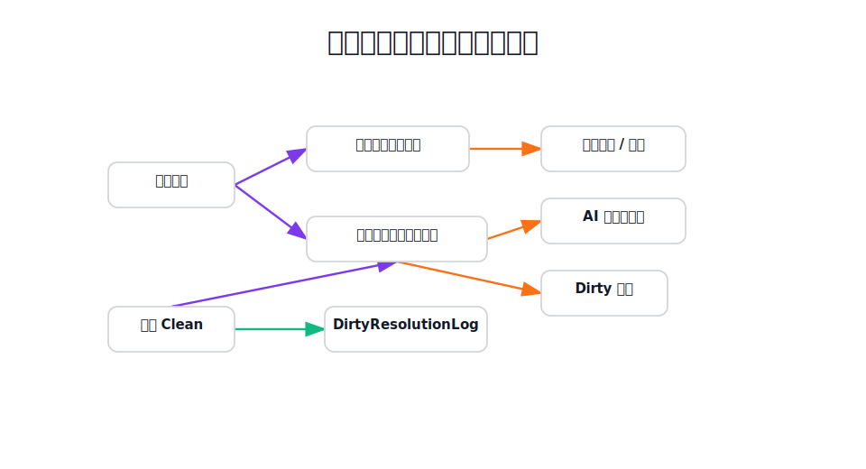

发布依赖快照不可修改。当前有效基线可在重新发布或手工 Clean 后更新。手工 Clean 不创建新版本，只记录审查结论并更新有效基线。

## 6. 状态传播设计

本节说明资产状态如何随发布事件变化。当上游资产发布新版本时，系统根据依赖图与传播策略判断下游是否需要审查或重新发布。ADAM 仅在具有明确事实依据时传播 Dirty，避免状态变化本身无限扩散；若 Dirty、Clean、Archived 等状态变化均触发传播，系统将产生难以解释的级联变化。因此系统仅在新版本发布时触发直接下游 Dirty，以保证影响链条可审计、可预测。

### 6.1 资产状态转换

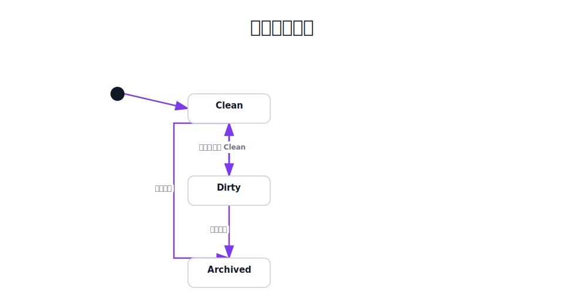

`Final` 资产不进入上述状态机。代码提交、流水线执行等不可变事实创建后即 Final，不接收 Dirty。

### 6.2 Dirty 传播规则

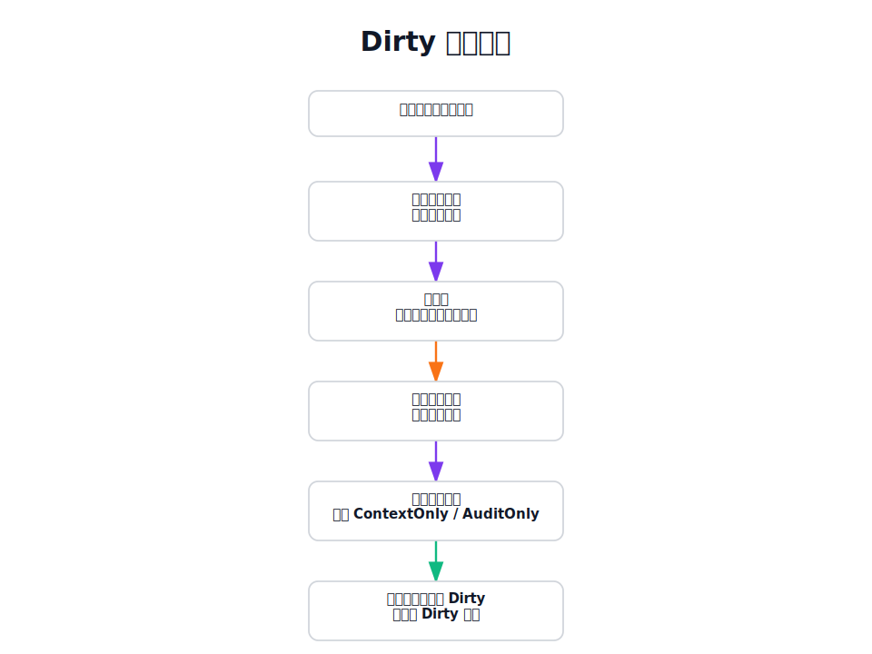

传播只影响直接下游。间接下游不会因为上游状态变化被同一次事件直接标记 Dirty，只有中间资产重新发布后才继续传播。

### 6.3 Dirty 处理方式

Dirty 状态可以通过两种方式处理：

| 方式 | 结果 | 是否创建新版本 | 是否触发下游 Dirty |
| --- | --- | --- | --- |
| 重新发布 | 下游资产发布新版本并更新依赖基线 | 是 | 是 |
| 手工 Clean | 审查确认上游变化无影响，更新有效基线 | 否 | 否 |

## 7. 工作流自动化设计

本节说明 ADAM 如何从资产状态跟踪系统扩展为研发流程驱动系统。资产图用于表达资产间依赖关系，Dirty 传播用于标识受影响的下游资产范围；研发过程还需定义处理主体、处理内容与完成条件。因此，工作流自动化独立于依赖传播建模，通过事件、规则、动作、任务与审批构成可追踪的流程闭环，使需求发布、资产 Dirty、流水线失败、Agent 执行完成等事件能够触发后续处理动作。自动化行为需具备可配置、可审计、可回放、可限流与可人工介入能力，并确保 AI Agent 在明确任务边界内执行，执行结果可回写至资产图与工作流链路。

### 7.1 事件驱动闭环

事件驱动闭环负责将资产事件转化为可执行动作，再将动作结果转化为新的资产事件，从而形成可追踪的自动化链路。例如需求发布后创建 feature 工作项，feature 工作项再创建 Agent 任务，Agent 产出代码提交后触发流水线，流水线结果再推动完成或修复流程。系统采用事件闭环而不是同步调用链，是为了使流程具备可审计、可重试、可异步执行能力，并能够在系统重启后从事件和动作状态恢复。

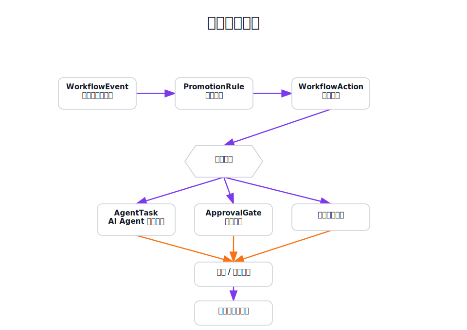

该闭环支持系统从资产变化推进到流程动作，再由流程动作产出新的资产或事件。

### 7.2 典型工作流

典型工作流描述系统首批需要支持的自动化场景，优先覆盖研发过程中最常见的三类流程：需求驱动开发、Dirty 资产审查和 Agent 任务执行。这些场景能够验证事件、规则、动作、Agent、人工审批、资产回写等核心机制；在这些机制验证通过后，后续 bugfix、release、maintenance 等工作流可以复用同一套模型。

#### 需求发布到功能工作

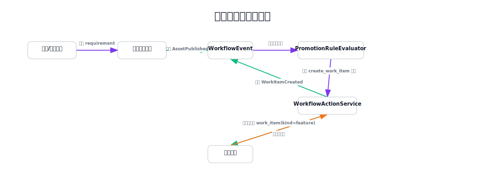

#### Dirty 资产到人工审查

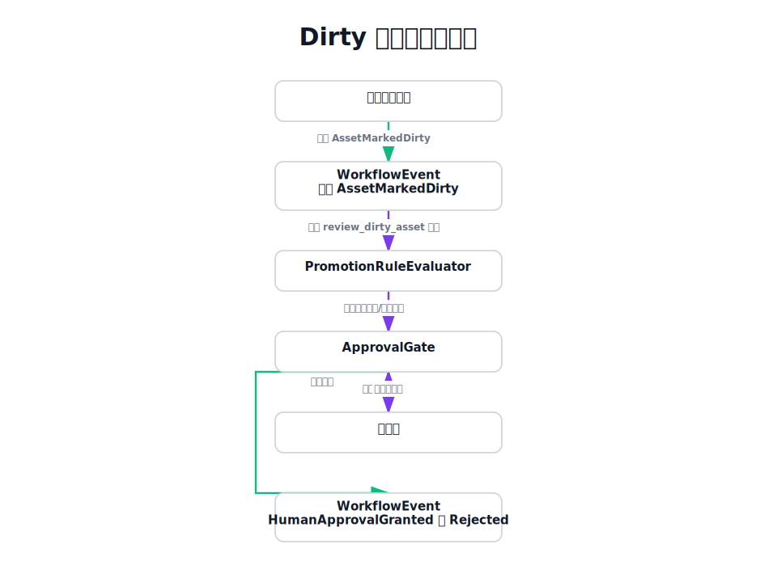

#### Agent 任务执行

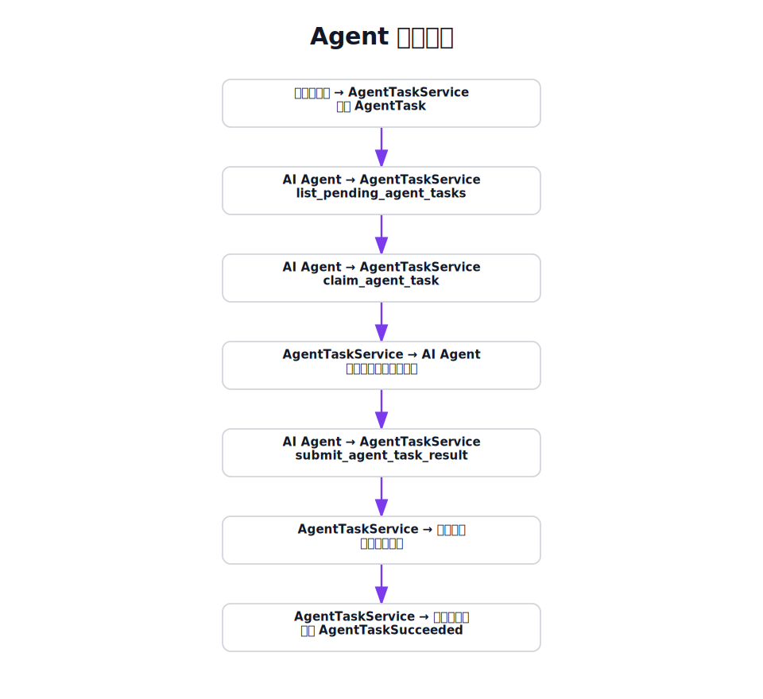

第一版 AgentTask 采用 pull 模型。Agent 主动查询和领取任务，系统通过原子 claim 保证同一个任务只被一个 Agent 执行。

### 7.3 工作流状态

工作流状态用于描述流程实例和动作的执行进度，与资产 Clean/Dirty/Archived 状态分离。资产状态描述资产是否可信，工作流状态描述流程是否推进；二者混用会导致“资产 Dirty”被误解为“流程失败”，或“流程完成”被误解为“资产 Clean”。因此工作流状态需要清楚表达等待、执行、审批、验证、阻塞、完成、失败和取消，便于系统恢复、人工查看和 Agent 协作。

WorkflowInstance 是流程容器，也是多动作 Saga 协调器。WorkflowAction 是单个动作。二者状态相互关联，但不替代资产状态。

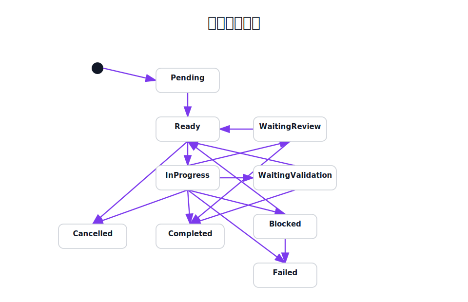

`WaitingReview` 表示等待人工判断，如审批、手工 Dirty 审查、人工分诊。`WaitingValidation` 表示等待自动化或策略验证，如流水线结果、规则复查、生成物验证。

### 7.4 失败、补偿与死信

失败处理机制用于处理 Agent 超时、外部系统失败、审批过期、部分动作成功后后续动作失败等情况。ADAM 管理的是跨资产、跨外部系统的研发流程，不能依赖单个数据库事务回滚全部副作用；因此失败必须可见、可重试、可补偿、可由人工接管，避免流程停留在未知状态。Saga 和 DeadLetter 分别表达“已经发生的事实”和“后续修复方式”。

工作流不回滚已发布资产。跨资产或跨外部系统的部分成功通过 Saga 协调：

1. 成功动作保留事实记录。
2. 后续动作失败时，根据补偿策略创建补偿动作。
3. 不可补偿的失败进入人工介入或死信队列。
4. 死信记录可由运维或负责人查看、重放、解决或忽略。

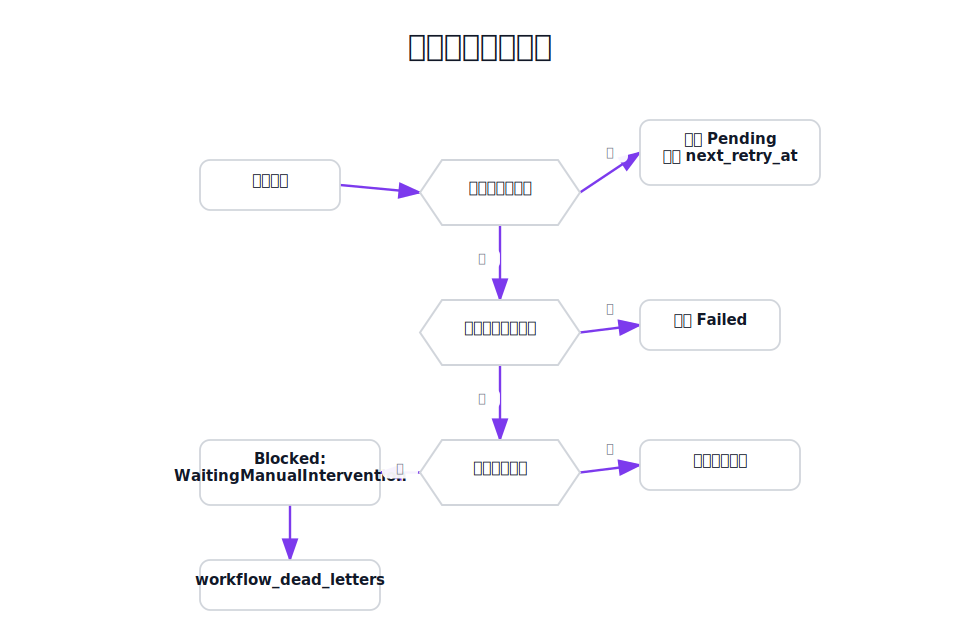

## 8. 规则与策略设计

本节说明系统如何将业务规则配置化，使依赖语义、传播行为与工作流触发条件能够被声明、审计与灰度调整。DependencyRule 与 PromotionRule 形式上都属于规则，但生命周期与输出完全不同：前者约束资产图，后者驱动流程动作。将二者拆分后，可分别控制资产间的关系语义与事件之后的处理动作，避免单一规则系统承担过多职责，亦使测试、审计与演进更加清晰。

### 8.1 DependencyRule

DependencyRule 控制资产实例之间是否允许建立依赖，并在发布时推断关系类型和传播策略。该规则定义：

- `source` 类型与 `target` 类型之间的依赖合法性。
- 适用的元数据条件。
- 匹配后的关系类型。
- 匹配后的传播策略。

### 8.2 PromotionRule

PromotionRule 控制事件是否转化为工作流动作。该规则定义：

- 触发事件类型。
- 适用的资产类型或元数据范围。
- 前置条件。
- 创建的工作流动作。
- 动作自动化等级。
- 规则生效的组织、项目或资产类型范围。
- 多个规则重叠时的冲突裁决方式。

规则冲突按以下原则处理：

```text
更具体的 scope 优先
  -> 生效窗口和灰度分段过滤
  -> 同一 mutex_group 内高 rule_version 优先
  -> 高 priority 优先
  -> 更保守的自动化级别优先
  -> 创建时间更早的规则作为最终裁决条件
```

### 8.3 自动化等级

自动化等级用于表达动作执行风险和人机协作边界，使低风险动作可以自动执行，高风险动作进入人工审批或人工执行。AI Agent 可以提高执行效率，但不应拥有不受约束的自治权限；自动化等级使系统能够在规则层面约束 Agent 的可执行动作以及需要人工确认的条件。

| 等级 | 说明 |
| --- | --- |
| Automatic | 系统可自动执行 |
| AgentSuggested | Agent 可生成建议或候选结果 |
| HumanApprovalRequired | 执行前必须经过人工审批 |
| HumanOnly | 只能由人工执行或决策 |

自动化等级用于限制风险。规则冲突时，同等条件下更保守的等级优先。

## 9. 数据视图

本节从数据关系角度描述系统，将前文的资产、依赖、状态与工作流概念映射为可持久化的对象分组，而非给出完整 DDL。概要设计不展开所有字段与索引，完整 DDL 由迁移文件承载；但本节必须说明数据对象边界，使读者理解哪些信息需要持久化、哪些对象之间存在主从或引用关系、哪些数据用于审计与恢复，否则后续实现容易将状态、事件与动作混合在同一张表中。

### 9.1 核心数据对象

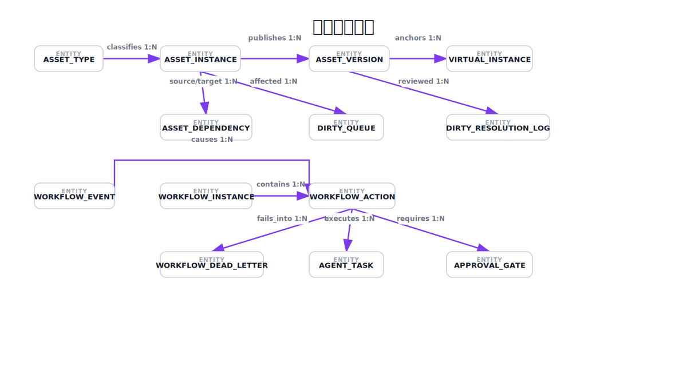

### 9.2 数据分组

| 分组 | 核心对象 | 用途 |
| --- | --- | --- |
| 资产模型 | AssetType, AssetInstance | 定义资产和资产分类 |
| 版本模型 | AssetVersion, AssetDependency | 固化发布历史和依赖基线 |
| 状态模型 | DirtyQueue, DirtyResolutionLog | 管理 Dirty、Clean、审查记录 |
| 上下文模型 | VirtualInstance | 为 AI Agent 构造临时上下文 |
| 工作流模型 | WorkflowEvent, WorkflowInstance, WorkflowAction | 驱动流程自动化 |
| 执行模型 | AgentTask, ApprovalGate, WorkflowDeadLetter | 管理 Agent 执行、人工审批和失败人工处理 |

## 10. Agent 上下文构造设计

本节说明 ADAM 如何将资产图转化为可供 AI Agent 使用的任务上下文。面向人的 DevOps 系统通常允许使用者在多个模块之间主动切换、判断信息相关性并补齐背景；Agent 则需要系统提供结构化、可解释、边界明确的上下文输入。若仅将代码、工作项、测试用例、流水线等模块分别暴露给 Agent，Agent 需自行判断跨模块关系，容易出现上下文缺失、上下文冗余或引用事实不一致的问题。因此 ADAM 将上下文构造作为独立能力，通过资产依赖图、版本基线、传播策略与虚拟资产实例，为 Agent 提供统一检索入口与可审计的上下文结果。

### 10.1 上下文构造原则

上下文构造遵循三个原则。首先，完整性要求系统能够从任务入口资产出发，找到与任务相关的上游依据、下游影响对象、当前 Dirty 原因、历史发布基线和验证结果，避免 Agent 在缺少关键事实的情况下执行。其次，准确性要求上下文中的每个资产引用都带有版本、关系类型和来源依据，避免把历史快照、当前基线和最新版本混用。最后，克制性要求系统根据关系类型、传播策略、资产类型、任务目的和权限边界裁剪上下文，避免把无关资产或过多历史记录交给 Agent。

### 10.2 上下文构造流程

上下文构造以资产、工作流动作或 AgentTask 作为入口。系统先解析入口对象关联的项目、组织、资产类型和权限边界，再根据任务类型选择依赖遍历策略：实现类任务侧重需求、设计文档、相关工作项和当前代码提交；验证类任务侧重需求、测试用例、测试执行记录和流水线结果；修复类任务侧重失败流水线、相关代码提交、测试用例、缺陷范围和上游需求。遍历结果需要经过版本基线解析、状态过滤、权限过滤和上下文预算控制，最终生成可被 Agent 消费的结构化上下文。

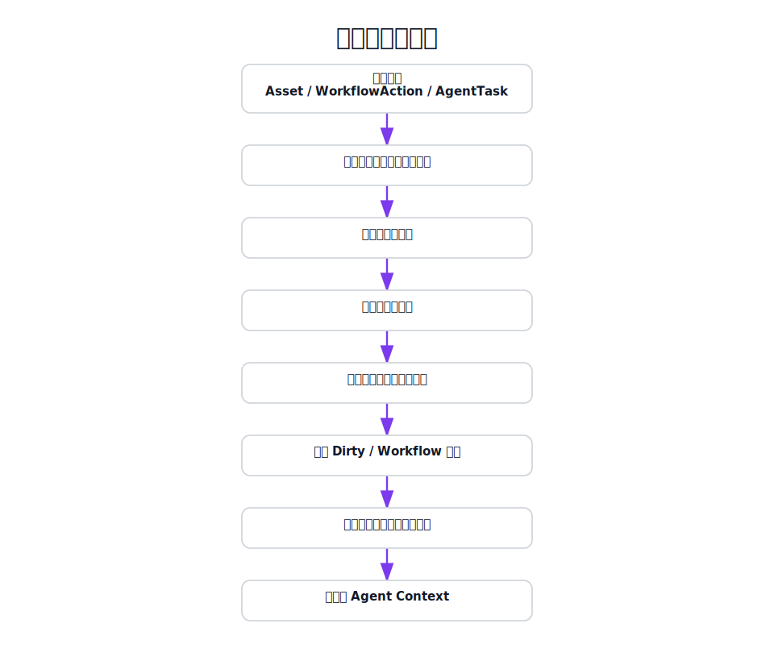

### 10.3 上下文结果组成

Agent 上下文结果不应只是资产列表，而应包含可解释的上下文包。上下文包至少包含入口对象、相关资产集合、资产之间的关系、采用的版本基线、Dirty 或失败原因、可执行任务说明、允许的操作边界以及引用来源。对于由工作流创建的 AgentTask，还需要包含任务目标、期望输出、回写位置和审批要求。上下文结果应记录生成策略和裁剪依据，使后续审计能够解释 Agent 基于哪些信息执行了任务。

| 组成 | 说明 |
| --- | --- |
| 入口对象 | 触发上下文构造的资产、动作或 AgentTask |
| 相关资产 | 与任务相关的需求、工作项、设计、代码、测试和流水线资产 |
| 关系说明 | 资产之间的依赖类型、传播策略和方向 |
| 版本依据 | 发布快照、当前有效基线和必要的最新版本信息 |
| 状态依据 | Dirty 原因、失败原因、审批状态和阻塞状态 |
| 操作边界 | Agent 可读取、可建议、可回写或必须等待审批的范围 |
| 审计信息 | 上下文生成时间、生成策略、过滤规则和来源引用 |

## 11. 外部交互设计

本节说明 ADAM 如何与人、AI Agent 及外部研发系统交互，重点定义系统入口与出口，而非展开具体 OpenAPI 字段。REST、MCP、Git Hook、CI/CD 均可能触发资产变化；若每个入口独立处理规则，同一事件在不同入口将产生不同行为。因此所有入口必须遵守同一组资产、依赖、状态与工作流规则。

### 11.1 REST API

REST API 服务于平台管理、外部系统集成和操作界面，覆盖：

- 资产类型管理
- 资产发布与查询
- 依赖图和影响分析
- Dirty 处理和手工 Clean
- 工作流事件、动作、审批、死信处理

所有对外枚举值使用稳定的 snake_case 字符串。

### 11.2 MCP 接口

MCP 接口服务于 AI Agent。Agent 通过 MCP：

- 查询资产上下文
- 创建虚拟资产上下文
- 查询待领取 AgentTask
- 领取任务
- 提交任务结果
- 查询工作流状态

MCP 工具不绕过平台业务规则，而是编排平台应用服务。

### 11.3 外部系统接入

外部系统接入负责将 Git、Wiki、项目管理和 CI/CD 中的事实同步到 ADAM，使正式发布、提交、流水线执行可以进入资产图和工作流，而不要求 ADAM 托管原始内容。外部系统已经是内容事实源，ADAM 的价值在于建立跨系统索引、依赖和自动化，而不是复制所有内容。

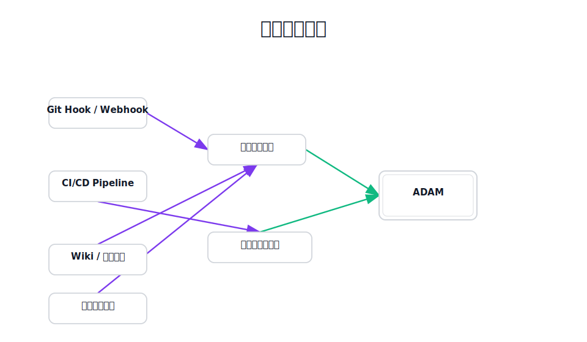

外部系统必须提供幂等键。Git 代码提交可使用 `source + project_id + repository + commit_sha`，CI/CD 执行可使用 `source + project_id + pipeline_id + run_id`。

## 12. 并发、一致性与幂等

本节说明系统在重复事件、并发执行与外部系统重试下如何保持一致，并约束实现时的事务边界、幂等键与锁策略。ADAM 依赖外部系统回调与异步 Worker，重复投递、并发领取、重试提交是常态；因此平台内部必须将幂等与并发控制作为基础能力，保证同一资产不会重复注册，同一事件不会重复生成动作，同一 AgentTask 不会被多个 Agent 同时执行。

ADAM 采用数据库事务、唯一约束、条件更新和锁版本共同保证一致性。

| 场景 | 设计 |
| --- | --- |
| 重复资产注册 | 使用外部来源幂等键去重 |
| 重复事件处理 | 使用 WorkflowEvent 来源键和 Action 幂等键去重 |
| Agent 并发领取 | 使用原子 claim 和行锁，确保只被一个 Agent 领取 |
| 审批并发决策 | 使用状态条件更新和 `lock_version` |
| 工作流多动作失败 | 使用 WorkflowInstance 作为 Saga 协调器 |
| 无法恢复的失败 | 写入 WorkflowDeadLetter，由人工处理 |

默认数据库隔离级别为 PostgreSQL `READ COMMITTED`。规则集替换等需要整体一致性的管理操作可使用更高隔离级别。

## 13. 权限与边界

本节说明系统访问与数据边界，保证资产图、工作流与 Agent 操作不会越过组织、项目与审批权限。AI Agent 与自动化流程会放大误操作影响；若权限仅在 UI 或某一 API 层检查，后台任务与 MCP 工具可能绕过边界。因此所有入口，包括 REST、MCP、Hook、Worker，均须遵守同样的组织与项目边界。

系统权限至少覆盖：

- 组织和项目访问边界
- 资产发布权限
- 依赖变更权限
- 手工 Clean 权限
- 工作流动作执行权限
- ApprovalGate 审批权限
- AgentTask 领取和提交权限

资产依赖不得跨组织或跨项目建立。工作流和 MCP 查询也必须遵守相同边界。

## 14. 观测与审计

本节说明系统历史行为的可解释性设计，为研发管理、问题排查、合规审计与工作流恢复提供证据链。自动化系统若缺乏可解释性，将难以获得团队信任；ADAM 面向研发资产生命周期，必须使每一次发布、Dirty、手工 Clean、规则触发、Agent 执行、审批与失败处理均可追溯，并能够说明资产进入 Dirty 的原因、任务创建依据以及触发动作的规则。

ADAM 应保留可解释的审计链：

- 资产版本的发布主体
- 发布时依赖了哪些上游版本
- 上游变化为何导致 Dirty
- Dirty 是通过重新发布还是手工 Clean 解决
- 哪个事件触发了哪个工作流动作
- 哪个 Agent 或审批人完成了动作
- 失败动作是否重试、补偿、死信或忽略

核心指标包括：

- Dirty 队列长度和等待时间
- 规则匹配、触发、跳过数量
- WorkflowAction 成功、失败、阻塞、重试数量
- AgentTask 领取延迟和执行耗时
- ApprovalGate 等待时长和超时数量
- Saga 补偿尝试和失败数量
- DeadLetter 打开、重放、解决、忽略数量

## 15. 典型端到端场景

本节通过端到端场景串联系统能力，展示资产、依赖、状态与工作流在真实研发过程中的协同方式，而非仅描述孤立模块。本节选择需求驱动开发、需求变更影响测试、流水线失败修复三类代表性链路，以证明模型能够支撑端到端业务闭环；若仅能解释单个对象，却无法解释完整研发链路，则系统边界仍不清晰。

### 15.1 需求驱动功能开发

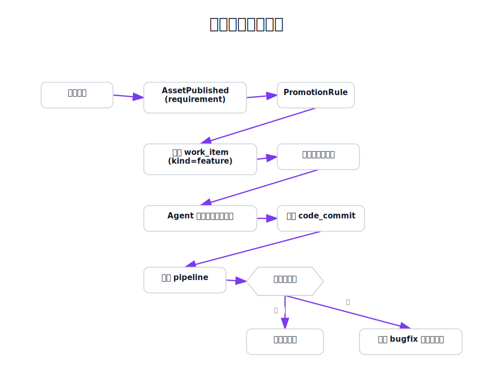

### 15.2 需求变更影响测试用例

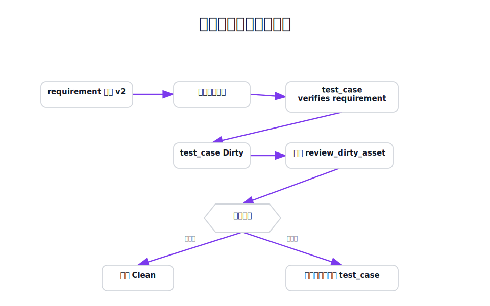

### 15.3 流水线失败触发修复流程

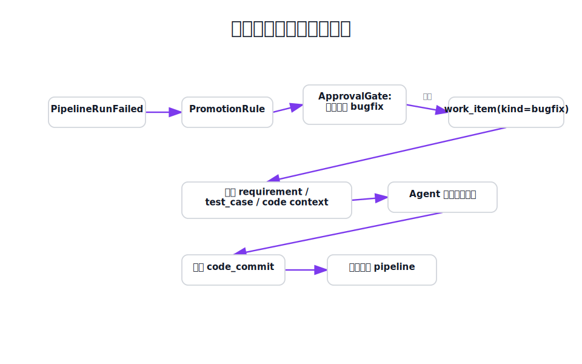

## 16. 非目标

本节明确当前设计排除的能力范围，用于防止范围膨胀，使实现阶段聚焦在资产管理、依赖传播与工作流驱动的核心能力上。ADAM 不承担完整项目管理系统、BPMN 平台、自动部署平台或不受约束的 Agent 执行器职责；这些能力未来均可与 ADAM 集成，但若在第一阶段全部纳入，将掩盖核心模型风险，并拖慢可用闭环的交付。

当前概要设计不包含：

- 完整 BPMN 引擎
- 可视化流程编辑器
- 跨项目工作流传播
- 自动合并代码或自动部署生产
- 不受约束的 Agent 自主执行
- 新增独立 `defect_report` 或 `test_report` 资产类型
- 完整数据库 DDL

## 17. 总结

ADAM 通过统一研发过程中的事实、依赖、状态与动作四层模型，构建研发资产管理平台：

- **事实层**：由资产、版本与事件记录研发过程中的客观事实。
- **依赖层**：由严格 DAG 与关系语义表达资产间的影响关系。
- **状态层**：由发布事件、传播策略与 Dirty 队列维护资产可信状态。
- **动作层**：由工作流规则、Agent 任务与人工审批驱动后续处理。

通过上述四层模型，ADAM 不仅是资产登记系统，更是能够为 AI Agent 提供可信上下文、为研发团队追踪影响并逐步驱动自动化协作的研发资产管理平台。
